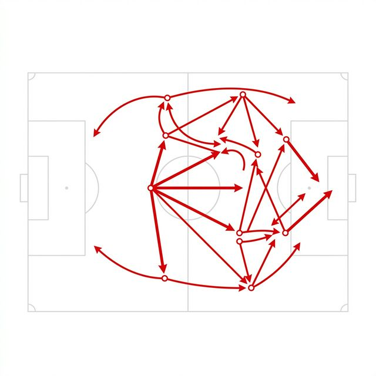
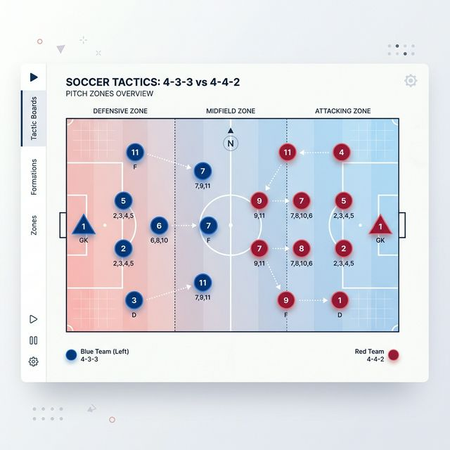

<style>
  body { background-color: #fafafa; color: #18181b; }
  h1, h2, h3, h4, h5, h6 { color: #09090b; font-weight: 800; letter-spacing: -0.02em; }
  a { color: #ef4444; text-decoration: none; transition: color 0.2s; }
  a:hover { color: #dc2626; text-decoration: underline; }
  .quarto-title-block .quarto-title-meta { color: #71717a; }
  .sourceCode { background-color: #f4f4f5 !important; border: 1px solid #e4e4e7 !important; }
  summary { color: #ef4444; font-weight: 600; cursor: pointer; padding: 0.5rem 0; }
  table { width: 100%; border-collapse: collapse; margin: 2rem 0; background-color: #ffffff; border: 1px solid #e4e4e7; border-radius: 8px; overflow: hidden; display: table !important; }
  th, td { padding: 1rem; border-bottom: 1px solid #e4e4e7; text-align: left; }
  th { background-color: #f4f4f5; color: #ef4444; font-weight: 800; text-transform: uppercase; font-size: 0.75rem; letter-spacing: 0.05em; border-bottom: 2px solid #e4e4e7; }
  tr:last-child td { border-bottom: none; }
  .cell-output-stdout { background-color: transparent !important; border: none !important; color: #71717a !important; padding: 0 !important; }
  .cell-output-display { overflow-x: auto; }
</style>

## The Idea



Arsenal under Mikel Arteta play a distinctive style — patient build-up, 
sustained pressure in the final third, and a relentless focus on getting 
the ball into dangerous positions. We wanted to put a number on it.

This project (done with Charlie Xue and Schahmyr Siddiqui for MATH 2210 
at Cornell) models Arsenal's 2024–25 Premier League open-play possession 
sequences as an **absorbing Markov chain**. The key result: a possession 
starting outside the attacking third has a **6.93%** chance of eventually 
producing a goal, with an expected sequence length of **5.44 actions**.

---

## Football Background

A **possession sequence** is a connected series of passes, carries, and 
shots by one team, ending when the ball is scored or lost. We model 
**open play only** — set pieces (corners, free kicks into the box) are 
excluded since they bypass the normal build-up structure.

The pitch is divided into three zones relative to the attacking team:



| Zone | Description |
|---|---|
| Everywhere Else (S1) | Defensive/midfield zone — goalkeeper, centre-backs, deep mids |
| Attacking Third (S2) | Ball has crossed into the final third |
| Opposition Box (S3) | Inside the 18-yard box |

Two absorbing states end the chain: **Goal (S4)** and **Turnover (S5)**.

---

## The Markov Chain Model

A Markov chain models a system that moves between states where the next 
state depends only on the current one — not on history. Formally:

$$P(S_{t+1} = j \mid S_t = i, S_{t-1}, \ldots) = P(S_{t+1} = j \mid S_t = i)$$

Transition probabilities form a $5 \times 5$ stochastic matrix $P$ 
$P_{44} = P_{55} = 1$ and the chain cannot leave.

### State Diagram

```{mermaid}
%%{init: {'theme': 'base', 'themeVariables': { 'primaryColor': '#ffffff', 'primaryTextColor': '#18181b', 'primaryBorderColor': '#e4e4e7', 'lineColor': '#a1a1aa', 'tertiaryColor': '#f4f4f5'}}}%%
stateDiagram-v2
    classDef default fill:#ffffff,stroke:#e4e4e7,stroke-width:2px,color:#18181b
    classDef highlight fill:#ef4444,stroke:#ef0107,stroke-width:2px,color:#ffffff,font-weight:bold
    
    S1: EE (S1)
    S2: ATK (S2)
    S3: BOX (S3)
    S4: Goal (S4)
    S5: Turn (S5)

    S1 --> S1: P11
    S1 --> S2: P12
    S1 --> S5: Pi5
    
    S2 --> S2: P22
    S2 --> S3: P23
    S2 --> S4: P24
    S2 --> S5: Pi5
    
    S3 --> S3: P33
    S3 --> S4: P34
    S3 --> S5: Pi5
    
    class S4,S5 highlight
```

---

## Building the Transition Matrix

All data is from Arsenal's full 2024–25 Premier League season 
(StatMuse, FBref, Premier League). Season aggregates give stable 
probability estimates — a single game would be too noisy.

```{python}
#| code-fold: true
#| code-summary: "Show raw data extraction"
import numpy as np
import pandas as pd
from IPython.display import display, Markdown

# Raw statistics from StatMuse [A,D], FBref [B], Premier League [C]
passes_completed   = 16360   # total passes completed
passes_final_third = 6479    # passes into the final third
total_touches      = 25374   # total touches
touches_box        = 1364    # touches inside the opposition box
goals_total        = 69      # total goals
goals_in_box       = 67      # goals scored inside the box
goals_outside_box  = 2       # goals scored outside the box
possessions_lost   = 4343    # possessions lost

# Derived probabilities
P12 = passes_final_third / passes_completed
touches_att_third = total_touches * P12
P23 = touches_box / touches_att_third
touches_att_not_box = touches_att_third - touches_box
P24 = goals_outside_box / touches_att_not_box
P34 = goals_in_box / touches_box
Pi5 = possessions_lost / total_touches  # uniform turnover rate

data = {
    "Transition": ["EE (S1) → ATK (S2)", "ATK (S2) → BOX (S3)", "ATK (S2) → Goal (S4)", "BOX (S3) → Goal (S4)", "Any Zone → Turnover (S5)"],
    "Probability": [P12, P23, P24, P34, Pi5]
}
df_probs = pd.DataFrame(data)
display(Markdown("**Derived Probabilities:**"))
display(Markdown(df_probs.to_markdown(index=False, floatfmt=".4f")))
```

Self-loops follow as $P_{ii} = 1 - \sum_{j \neq i} P_{ij}$.

Three structural assumptions:

1. **No backward transitions** — when a professional side advances, its 
   shape and forward options persist even if the ball briefly drops.
2. **$P_{13} = 0$** — a direct pass from outside the attacking third 
   into the box is near-impossible at elite level.
3. **Uniform turnover rate** — higher risk in the final third is 
   acknowledged but a uniform rate keeps the model data-driven.

```{python}
#| code-fold: true
#| code-summary: "Show transition matrix construction"
# Construct the full 5x5 transition matrix
P11 = 1 - P12 - Pi5
P22 = 1 - P23 - P24 - Pi5
P33 = 1 - P34 - Pi5

P = np.array([
    [P11,  P12,  0,    0,    Pi5 ],
    [0,    P22,  P23,  P24,  Pi5 ],
    [0,    0,    P33,  P34,  Pi5 ],
    [0,    0,    0,    1.0,  0   ],
    [0,    0,    0,    0,    1.0 ],
])

states = ["EE (S1)", "ATK (S2)", "BOX (S3)", "Goal (S4)", "Turn (S5)"]

df_P = pd.DataFrame(P, index=states, columns=states)
display(Markdown("**Transition Matrix P:**"))
display(Markdown(df_P.to_markdown(floatfmt=".4f")))
```

---

## Results

### Initial State and Iterations

We start from S1 with $S_0 = (1, 0, 0, 0, 0)^T$ — possession begins 
outside the attacking third.

```{python}
#| code-fold: true
#| code-summary: "Show sequence iterations logic"
import matplotlib.pyplot as plt
import matplotlib.patches as mpatches

s0 = np.array([1.0, 0.0, 0.0, 0.0, 0.0])

# Compute S1 and S2 by hand (matrix multiplication)
s1 = s0 @ P
s2 = s1 @ P

# S10 via matrix power
s10 = s0 @ np.linalg.matrix_power(P, 10)

df_iters = pd.DataFrame([s0, s1, s2, s10], index=['S0', 'S1', 'S2', 'S10'], columns=states)
display(Markdown("**State evolution over initial iterations:**"))
display(Markdown(df_iters.to_markdown(floatfmt=".4f")))
```

```{python}
#| code-fold: true
#| code-summary: "Show convergence scatterplot logic"
# Visualise convergence across iterations
iterations = range(0, 31)
state_probs = {name: [] for name in states}

sv = s0.copy()
for n in iterations:
    for i, name in enumerate(states):
        state_probs[name].append(sv[i])
    sv = sv @ P

plt.style.use('default')
fig, ax = plt.subplots(figsize=(10, 5))
fig.patch.set_facecolor('#fafafa')
ax.set_facecolor('#ffffff')

# Arsenal specific palette
colors = ["#1e3a8a", "#eab308", "#14b8a6", "#ef4444", "#3f3f46"]

for (name, color) in zip(states, colors):
    ax.plot(list(iterations), state_probs[name],
            label=name, color=color, linewidth=2.5)

ax.set_xlabel("Step $n$", fontsize=12, fontweight='bold', color='#52525b')
ax.set_ylabel("Probability", fontsize=12, fontweight='bold', color='#52525b')
ax.set_title("Convergence of Arsenal's Markov Chain toward the steady state", fontsize=14, fontweight='900', color='#09090b', pad=15)

ax.spines['top'].set_visible(False)
ax.spines['right'].set_visible(False)
ax.spines['bottom'].set_color('#e4e4e7')
ax.spines['left'].set_color('#e4e4e7')
ax.grid(color='#f4f4f5', linestyle='-', linewidth=1)

ax.legend(fontsize=10, loc="center right", frameon=True, facecolor='#ffffff', edgecolor='#e4e4e7')
plt.tight_layout()
plt.savefig("convergence.png", dpi=300, bbox_inches="tight")
plt.show()

display(Markdown(f"> *By step 10, the chain is heavily absorbed. Probability of Goal: **{s10[3]:.4f}** | Turnover: **{s10[4]:.4f}***"))
```

### Steady State and Fundamental Matrix

Because S4 and S5 are absorbing and every transient state can reach 
both in finitely many steps, a unique steady-state $\bar{S}$ exists, 
supported entirely on {S4, S5}.

The **fundamental matrix** $N = (I - Q)^{-1}$ gives the expected number 
of steps spent in each transient state before absorption:

```{python}
#| code-fold: true
#| code-summary: "Show Python matrix inversion code"
# Extract Q (transient-to-transient) and R (transient-to-absorbing)
Q = P[:3, :3]
R = P[:3, 3:]

# Fundamental matrix
I3 = np.eye(3)
N = np.linalg.inv(I3 - Q)

df_Q = pd.DataFrame(Q, index=states[:3], columns=states[:3])
df_R = pd.DataFrame(R, index=states[:3], columns=states[3:])
df_N = pd.DataFrame(N, index=states[:3], columns=states[:3])

display(Markdown("**Q (Transient to Transient):**"))
display(Markdown(df_Q.to_markdown(floatfmt=".4f")))

display(Markdown("**R (Transient to Absorbing):**"))
display(Markdown(df_R.to_markdown(floatfmt=".6f")))

display(Markdown("**Fundamental Matrix N = (I - Q)⁻¹:**"))
display(Markdown(df_N.to_markdown(floatfmt=".4f")))

expected_steps = pd.DataFrame(N.sum(axis=1), index=states[:3], columns=["Expected Actions"])
display(Markdown("**Expected actions before absorption:**"))
display(Markdown(expected_steps.to_markdown(floatfmt=".4f")))
```

```{python}
#| code-fold: true
#| code-summary: "Show steady state derivation logic"
# Absorption probabilities B = NR
B = N @ R

df_B = pd.DataFrame(B, index=states[:3], columns=states[3:])
display(Markdown("**Absorption Probabilities (B = NR):**"))
display(Markdown(df_B.to_markdown(floatfmt=".4f")))

# Steady state from S0 = e1
s_bar = np.array([0, 0, 0, B[0, 0], B[0, 1]])

# Confirm via matrix power
s100 = s0 @ np.linalg.matrix_power(P, 100)

summary_df = pd.DataFrame([s_bar, s100], index=["Steady state (Analytical)", "Confirmed via P^100"], columns=states)
display(Markdown("**Verification of Steady State:**"))
display(Markdown(summary_df.to_markdown(floatfmt=".4f")))

# Possessions per goal
poss_per_goal = 1 / B[0, 0]
display(Markdown(f"> *Expected possessions per goal from S1 (Defensive Third): **{poss_per_goal:.1f}***"))
```

---

## Discussion

The numbers tell a clear story about Arteta-ball.

**The bottleneck is progression, not finishing.** Entry from the 
attacking third to the box occurs at only $P_{23} = 0.136$ per step. 
Once inside, Arsenal are efficient: $P_{34} = 0.049$ means roughly one 
goal per 20 box touches, consistent with 69 league goals.

**The box self-loop is the model's most interesting number.** 
$P_{33} = 0.780$ means that on any given step inside the box, there is 
a 78% chance the ball stays there. The fundamental matrix confirms this: 
a possession starting in S3 spends **4.54 steps** in the box before 
resolving. That is the numerical signature of Arteta's positional system.

**External validity check.** Arsenal need ~14.4 S1 possessions to 
score once. With ~25–30 open-play possessions per game and 69 goals 
across 38 matches, the model's conversion rate of ~7% is a plausible 
order of magnitude.

### Limitations

- **Stationarity** — probabilities are constant across all opponents 
  and game states. Arsenal vs. City is not Arsenal vs. Sheffield United.
- **Uniform turnover rate** — one rate across all zones underestimates 
  risk in the final third under pressing.
- **No backward transitions** — the model cannot represent a possession 
  that regresses from the attacking third mid-sequence.
- **Open play only** — set pieces place the ball directly in S3, 
  bypassing S1 and S2. Arsenal are one of the league's top set-piece 
  teams and this is a real gap.
- **Source (C)** — goals outside the box (= 2) came from a video 
  compilation rather than a formal statistics database.

---

## References

[A] StatMuse — Arsenal 2024–25 PL Passing Stats.
<https://www.statmuse.com/fc/club/2024-25-arsenal-6/stats/2025?statCategory=passing>

[B] FBref — Arsenal 2024–25 PL Squad Stats.
<https://fbref.com/en/squads/18bb7c10/2024-2025/c9/Arsenal-Stats-Premier-League>

[C] Premier League — Goals Outside the Box, September 2024.
<https://www.premierleague.com/en/video/4120700>

[D] StatMuse — Arsenal Possession Lost 2024–25 PL.
<https://www.statmuse.com/fc/ask?q=possession+lost+by+arsenal+players+24-25&l=pl>
